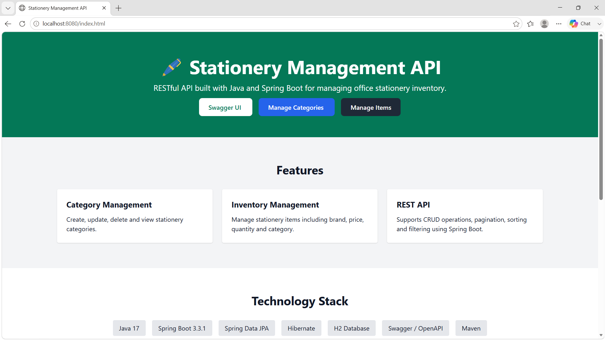
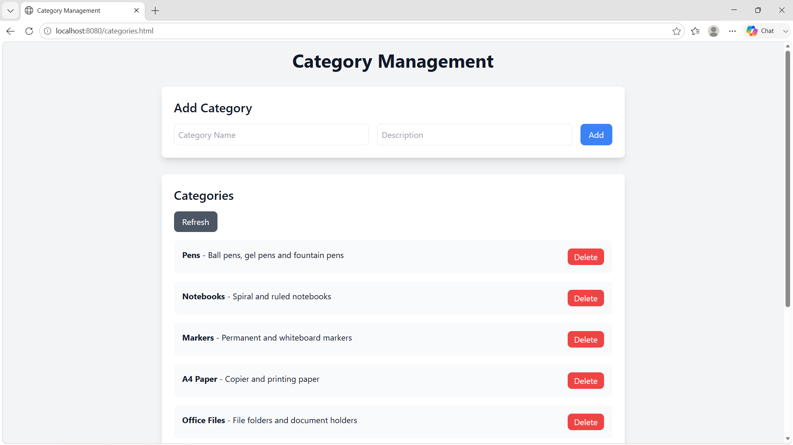
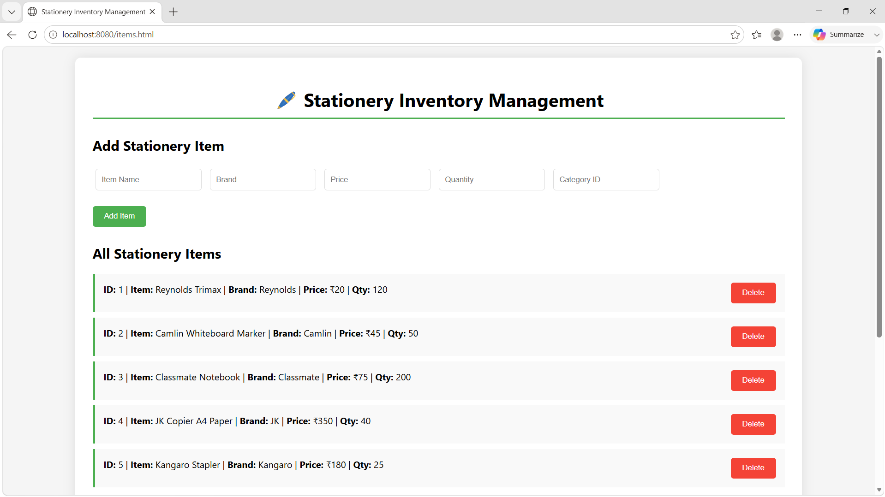
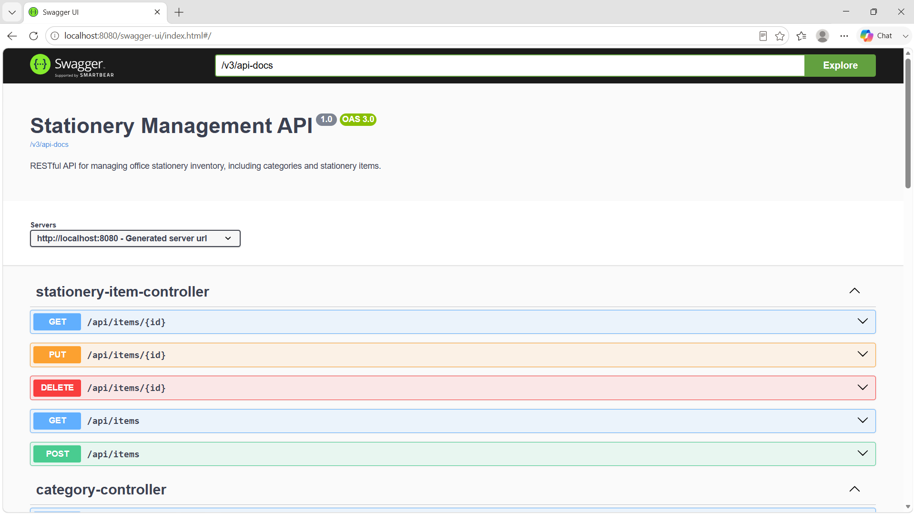
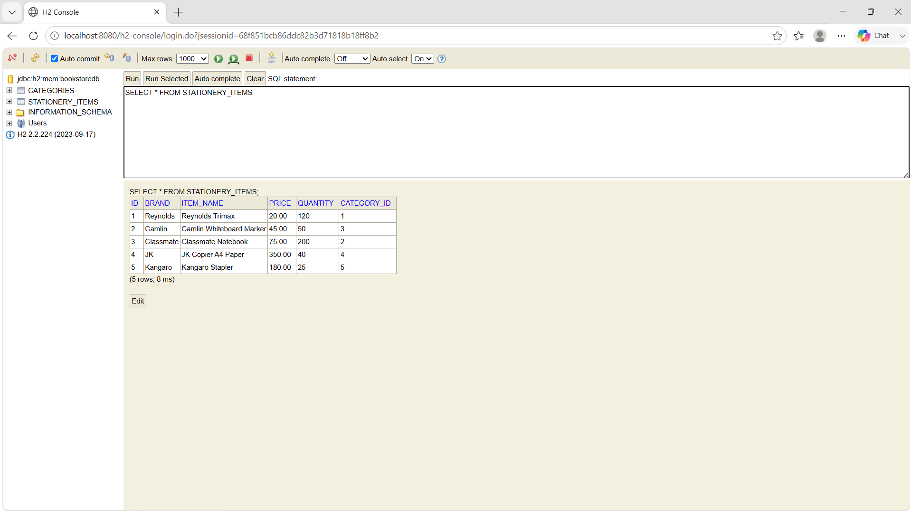

# 🖊️ Office Stationery Inventory Management System

A comprehensive **Spring Boot REST API** for managing office stationery
inventory such as pens, markers, notebooks, A4 paper, files, and other
consumables.

The application demonstrates a clean layered architecture using **Spring
Boot**, **Spring Data JPA**, **Hibernate**, and an **H2 in-memory
database**. It provides complete CRUD functionality, pagination,
sorting, filtering, Swagger documentation, and a simple HTML frontend.

------------------------------------------------------------------------

# ✨ Features

-   CRUD operations for **Categories**
-   CRUD operations for **Stationery Items**
-   One-to-Many relationship between Categories and Items
-   Pagination and sorting
-   Dynamic filtering
-   Swagger/OpenAPI documentation
-   Global exception handling
-   H2 in-memory database
-   Static HTML frontend
-   Clean layered architecture

------------------------------------------------------------------------

# 🛠 Technology Stack

-   Java 17
-   Spring Boot 3.3.1
-   Spring Data JPA
-   Hibernate
-   H2 Database
-   SpringDoc OpenAPI (Swagger)
-   Maven
-   HTML, CSS and JavaScript

------------------------------------------------------------------------

# 📸 Application Screenshots

## 🏠 Home Page



---

## 📂 Category Management



---

## 📝 Stationery Item Management



---

## 📖 Swagger API Documentation



---

## 🗄️ H2 Database



------------------------------------------------------------------------

# 📂 Project Structure

``` text
src
├── main
│   ├── java/com/utkarsh/bookstore
│   │   ├── controller
│   │   ├── exception
│   │   ├── model
│   │   ├── repository
│   │   ├── service
│   │   ├── CorsConfig.java
│   │   └── OpenAPIConfig.java
│   └── resources
│       ├── static
│       │   ├── index.html
│       │   ├── categories.html
│       │   └── items.html
│       └── application.properties
```

------------------------------------------------------------------------

# 📦 Entities

## Category

-   id
-   name
-   description

## Stationery Item

-   id
-   itemName
-   brand
-   price
-   quantity
-   categoryId

Each category can contain multiple stationery items.

------------------------------------------------------------------------

# 🚀 REST Endpoints

## Categories

  Method   Endpoint
  -------- ----------------------
  GET      /api/categories
  GET      /api/categories/{id}
  POST     /api/categories
  PUT      /api/categories/{id}
  DELETE   /api/categories/{id}

## Stationery Items

  Method   Endpoint
  -------- -----------------
  GET      /api/items
  GET      /api/items/{id}
  POST     /api/items
  PUT      /api/items/{id}
  DELETE   /api/items/{id}

------------------------------------------------------------------------

# 📄 Sample Request

``` json
{
  "itemName":"Reynolds Trimax",
  "brand":"Reynolds",
  "price":20.0,
  "quantity":100,
  "categoryId":1
}
```

# 📄 Sample Response

``` json
{
  "id":1,
  "itemName":"Reynolds Trimax",
  "brand":"Reynolds",
  "price":20.0,
  "quantity":100,
  "categoryId":1
}
```

------------------------------------------------------------------------

# ▶️ Running the Project

``` bash
mvn clean install
mvn spring-boot:run
```

Application

-   http://localhost:8080

Swagger

-   http://localhost:8080/swagger-ui/index.html

H2 Console

-   http://localhost:8080/h2-console

Frontend

-   http://localhost:8080/index.html

------------------------------------------------------------------------

# 📚 Concepts Demonstrated

-   REST API Development
-   Spring Boot
-   Spring Data JPA
-   Hibernate ORM
-   Entity Relationships
-   Pagination
-   Sorting
-   Filtering
-   Exception Handling
-   Swagger Documentation
-   H2 Database
-   Layered Architecture

------------------------------------------------------------------------

# 👨‍💻 Author

**Utsav Kumar Singh**

B.Tech CSE

Java Backend Developer

------------------------------------------------------------------------

This project was developed for learning backend development using Spring
Boot and demonstrates modern REST API development practices.
